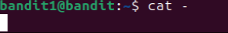

# Bandit Level 1 -> Bandit Level 2 #

## Level Goal##

The password for the next level is stored in a file called - located in the home directory

## Details ##

First type ```exit```, to cancel the SSH connection to bandit0. 

Following up on the previous level, we will need to ssh into ```bandit1@bandit.labs.overthewire.org``` this time. When asked for the password, we will input the password from the readme file we obtained earlier.

## Commands ##
``` ls ```

``` cat ```

``` ./ ``` Used as a prefix to indicate current directory. When used with commands, it will look for the path instead of the individual file.

## Solution ##
Once again, you may use ```ls``` to look at the current files in the directory. As per the instructions, there is a ```-``` file. If you do ```cat -```, nothing will happen because normally ```-``` implies an argument in Bash. In which case, this is a file and not an argument so there will be a conflict.

As such we will need to use the prefix ```./``` before the file name to signify the path. Overall, the command would look like:

    cat ./-
    
Once that's done, you will get the password to the next level.

* PS. If you find yourself stuck like this:



Simply click `CTRL+C` to go back.